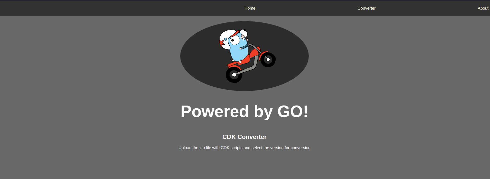

# GO Web Server for CDK converter





### Building

```
go build -o build/ cmd/api/main.go
```


### Running

```
go run cmd/api/main.go
```


### References

* Project folder structure best practice in go https://github.com/golang-standards/project-layout
* Go Documentation https://go.dev/doc/
